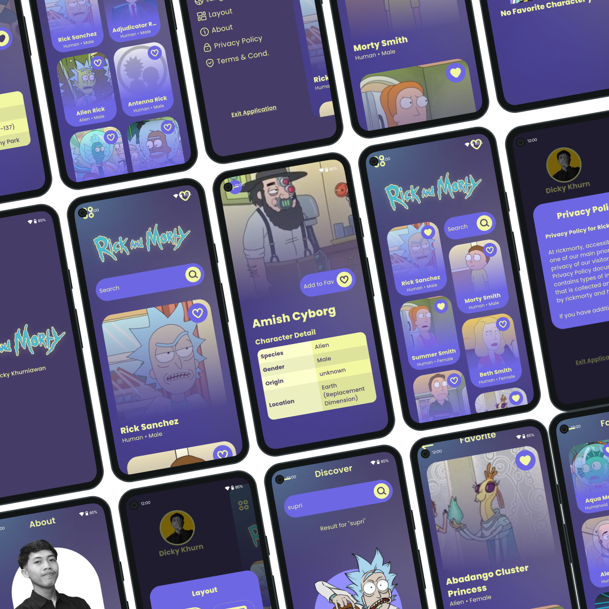
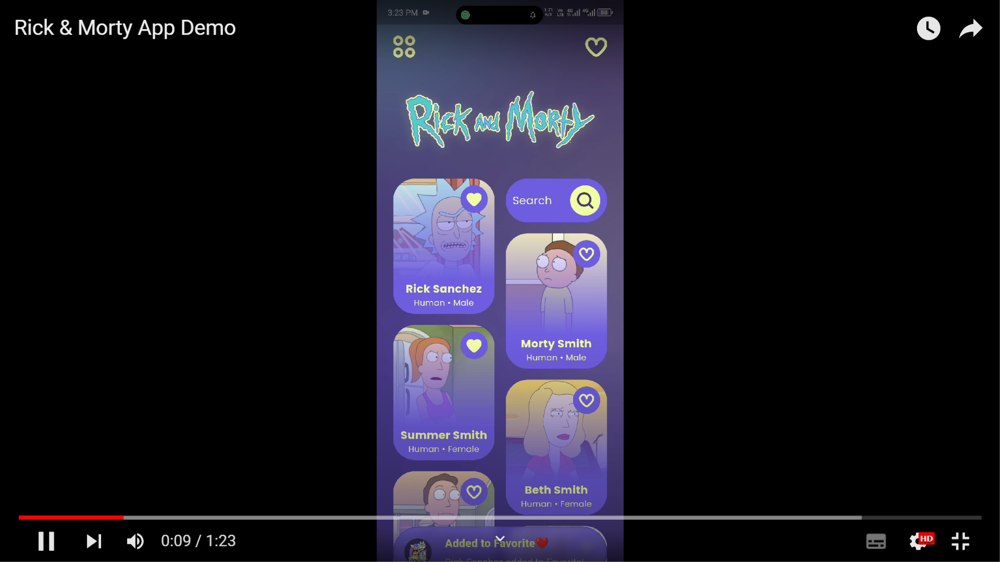

 

# Rick & Morty App
## by Dicky Khurniawan

<a href="https://www.instagram.com/dxkrn">
  
</a>.
<a href="https://www.linkedin.com/in/dicky-khurniawan-a0057a2a5">
  
</a>.
<a href="https://github.com/dxkrn">
  
</a>


## <a name="introduction"></a> Introduction👋

Rick & Morty is a mobile application containing information about the characters from the animation called "Rick & Morty". This application was developed using the Flutter framework and consumes data from https://rickandmortyapi.com/.

## Table of Contents 📃
- [Introduction](#introduction)
- [Pages & Features](#pages-features)
- [Libraries](#libraries)
- [Project Structure](#project-structure)
- [Project Running Steps](#project-running-steps)
- [Application Link](#application-link)
- [Preview](#preview)

## <a name="pages-features"></a>Pages & Features 📱

Rick & Morty app consists of the following pages:
- Splash Page : displays Rick & Morty's logo for introduction
- Home Page : displays a list of characters in grid or list form
- Detail Page : displays complete information of the character
- Discover Page : finds specific characters based on user keywords
- Favorite Page : displays a list of the user's favorite characters
- About Page : displays a list of the user's favorite characters


Rick and Morty app has several features, including:
- App Drawer : contains menus such as language, layout, about, privacy policy, and terms & conditions
- Layout : change layout style (gridview or listview)
- Search : search for characters specifically based on user keywords
- Infinite Scroll / Pagination : fetch data from API continuously based on scroll (fetch more and more)
- Favorite : add and remove favorite characters from local database (sqflite)
- Empty State : displays illustrations on pages with empty data 

> Data in the application is sourced from the <b>API https://rickandmortyapi.com/</b> for data on all characters and a <b>local database with sqflite</b> for data on users' favorite characters


## <a name="libraries"></a> Libraries 📚

Rick & Morty app uses several libraries such as:

- [Flutter v3.16.5] - used as mobile development framework
- [Dio] - used for HTTP Requests
- [Flutter Advanced Drawer] - used for create beautiful app drawer
- [Flutter Screenutil] - used for managing screen size and layout for responsive UI
- [Get] - used for state management
- [Get Storage] - used for store simple data into local storage like Shared Preference
- [Shimmer] - used for create shimmer effect animation
- [Sqflite] - used for store data in local relational database
- [Styled Text] - used for formating text, like italic, bold, etc. using tags like HTML
- [Url Launcher] - used for launching specific URL

All libraries are available on https://pub.dev/.

## <a name="project-structure"></a> Project Structure 🗂️

The structure of this project uses the getX pattern which uses an MVC approach.

- android
- build
- ios
- lib
    - app
        - data
            - database
            - global
            - storage
        - models
        - modules
            - <i>page name</i>
                - bindings
                - controllers
                - views
        - routes
    - assets
        - icons
        - images
    - widgets
- linux
- macos
- test
- web
- windows


## <a name="project-running-steps"></a> Project Running Steps ▶️

To run the project on your device, follow these steps:

First step:

```sh
git clone https://github.com/dxkrn/rickmorty
```
Second step:

```sh
flutter clean
```
Third step:

```sh
flutter pub get
```
Last step:

```sh
flutter run
```

Enjoy the app!😊

## <a name="application-link"></a> Application Link 🔗
The Rick & Morty by Dxkrn application can be downloaded at the following link:
https://s.id/rickmorty-dxkrn or click on the 

<a href="https://s.id/rickmorty-dxkrn">
  
</a>

## <a name="application-link"></a> Preview 💡

 

 []( https://youtu.be/PplwXPTjAMo)

[Flutter v3.16.5]: <https://flutter.dev/>
[Dio]: <https://pub.dev/packages/dio>
[Flutter Advanced Drawer]: <https://pub.dev/packages/flutter_advanced_drawer>
[Flutter Screenutil]: <https://pub.dev/packages/flutter_screenutil>
[Get]: <https://pub.dev/packages/get>
[Get Storage]: <https://pub.dev/packages/get_storage>
[Shimmer]: <https://pub.dev/packages/shimmer>
[Sqflite]: <https://pub.dev/packages/sqflite>
[Styled Text]: <https://pub.dev/packages/styled_text>
[Url Launcher]: <https://pub.dev/packages/url_launcher>
